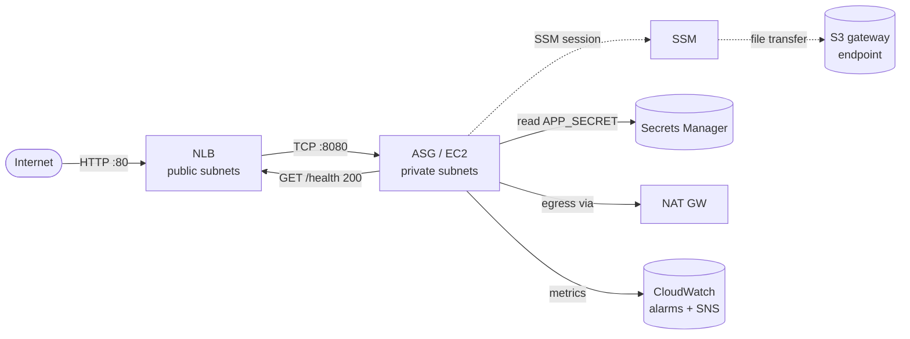

# Solution

## Quick inspect links

- Repository: https://github.com/gerhardkeuck/neal-street-assignment
- Cloudwatch metrics overview: https://eu-west-1.console.aws.amazon.com/cloudwatch/home?region=eu-west-1
- Deployed endpoint: [rewards-dev-nlb-931cf46fa8a045c7.elb.eu-west-1.amazonaws.com/health](http://rewards-dev-nlb-931cf46fa8a045c7.elb.eu-west-1.amazonaws.com/health)

## Architecture overview

Public traffic enters through a single NLB and reaches a private ASG of EC2 instances that serve the JSON
health endpoint. Operators connect over SSM (no SSH, no public IPs). The application reads its secret from
Secrets Manager via the instance profile, so no credentials are exchanged through Ansible or CI. Two
CloudWatch alarms cover the brief's observability questions: `HealthyHostCount < 1` ("is it up?") and ASG
`CPUUtilization > 80%` ("is it overloaded?").



Delivery model: a PR runs `terraform plan` and posts the diff; merging `main` fans out to
`dev-tf-apply` (infra) and `deploy-app-dev` (Ansible over SSM) in parallel, each gated by its own
`environment: dev` and OIDC role.

## Tasks breakdown order

High level task sequence breakdown, accounting for dependencies between tasks:

- Create a minimal Go app to expose endpoint and generated logs
- GHA for go app: Test, build and release on Github Actions.
- Create terraform backend bootstrap.
- Create `managed` resources, for GHA to use Ansible and Terraform.
    - Role to assume, SSM to EC2, sufficient admin for Terraform management.
- Create GHA workflows for managing `live` terraform resources.
- Create `dev` live environment Terraform resources.
- Create Ansible playbook/roles/inventory for deploying from GitHub to EC2 group.
- Configure logging with Cloudwatch logs.
- Teardown steps.
- Smoke test solution during and afterward.

Continuously update README.md and SOLUTION.md while progressing.

## Reasoning for decisions

This project quite a white scope of decisions that had to be taken into account to deliver the solution within the
project constraints. Here the high level reasons for choices are explained.

### Terraform state handling approach

State is stored remotely in an S3 backend with native S3 locking (one lockfile per state object) and bucket
versioning + default encryption enabled. The bucket is created once by `terraform/bootstrap-backend.sh` to break the
chicken-and-egg before Terraform itself can manage state.

Trade-offs vs. the alternatives, in the context of a small team:

- **vs. local state**:
    - Gain: concurrent safe collaboration, durable history, CI can plan/apply against the same state a developer just
      produced.
    - Cost: one-off bootstrap script and an extra S3 bucket per account and store for state files.
- **vs. Terraform Cloud / HCP**:
    - Pros: zero cost, no extra vendor, runs are on GitHub Actions.
    - Cons: no managed run UI, no built-in policy/cost gates (acceptable at this size).

### Multiple Terraform projects

There are two parts for the Terraform solution:

- The `management` module provisions the required resources for the Github Actions runners to have necessary access to
  AWS. This need to be run manually beforehand.
- The `live` module provisions infrastructure for the `dev` (and `prod` if vars are defined) environments. This module
  can be fully managed through git PRs.

### Single module for live environments

The `live` module is designed to be a single module for managing infrastructure across multiple environments. This
approach simplifies the management of infrastructure by consolidating the configuration and state
management into a single module, making it easier to maintain and update across environments.

If the project grows too much, this might become cumbersome and need to be split into multiple modules, each responsible
for a specific set of resources or environments. Various solutions and approaches available to address this when it
relevant.

### Consistent AWS tagging

Defaults for tags are defined on the AWS provider to ensure all resources that support tags include those tags.
Additional tag definition were added to launch template to ensure on demand instances also contain the correct tags.

### Networking

A VPC is created per environment, ensuring no shared routing between `dev` and `prod` environments by default.
Separate Public and Private subnets are used to separate traffic between public ingress for load balancers and private
traffic between load balancers and application servers.

Using a Network Loadbalancer as that can be deployed to a single AZ (compared to ALB).

## Observability

A few basic Cloudwatch metrics with alarms have been configured:

- "Is it up?": when `HealthyHostCount < 1` on the NLB target group.
- "Is it overloaded?": when the average ASG CPU above `80%` for `10` minutes.
- Alarms publish to an SNS topic.
- Email subscription is optional through `alarm_email`.

A CloudWatch log group exists as a placeholder for future centralized logs. The current implementation does not
install/configure the CloudWatch agent by default (uncomplete).

### Minimal app

Created a minimal app to demonstrate:

- exposing the health endpoint
- consuming a secret (in combination with Ansible).
- logging to Cloudwatch logs

An example Golang application is used to provide the health endpoint. It receives the necessary configuration by reading
an.env file.

#### Secret management

Ansible reads the secret from Secrets Manager. This could be managed natively in th Go app to reduce secret storage on
disk. Used ansible to keep as much management as part of Ansible.

### Rollbacks

Two independent levers, matching the two halves of the pipeline:

- **Application rollback**: re-run `deploy-app-dev.yaml` (or the prod equivalent) with `workflow_dispatch` and a
  prior release's `binary_url`. The playbook is idempotent and the ASG is unchanged, so this completes in the time
  it takes for systemd to swap the binary and restart.
- **Infrastructure rollback** — revert the offending commit on `main`. The plan/apply pipeline runs the inverse
  diff. For destructive changes that cannot be cleanly reverted (e.g. a deleted resource), `terraform state` +
  S3 object versioning on the state bucket provide a recovery path.

As infrastructure changes could be more complex, the general rule of fail forward should be followed.

The deliberate split (TF for infra, Ansible for app) means an app-level regression never requires touching infra,
which keeps the blast radius of a rollback small.

### Secret management

The sample APP_SECRET value is stored outside source control in a Secrets Manager secret. During deploy, Ansible fetches
the secret using the EC2 instance profile and renders it into /etc/rewards/app.env.
Secret-handling tasks use no_log: true to avoid leaking values into CI logs. This keeps secrets out of the
repository, while accepting the operational trade-off that the secret exists on disk on the instance.

For this project I chose rendering the secrets with Ansible, though in practice I would prefer to retrieve secrets
directly from AWS Secrets Manager. This limits secret persistence to disk en ensure secrets will not be visible to
Ansible logs or other deployment related runners.

### Modules between environments

For this assignment a single AWS account was used, given the assignment constraints. Only the `dev` environment has been
provisioned. In a production rollout, I would promote the same Terraform/Ansible pattern into a separate prod AWS
account, using a distinct Terraform backend/state path, separate GitHub OIDC IAM role, separate secret
namespace, and manual approval before apply. This keeps blast radius, credentials, and audit boundaries separate without
adding unnecessary complexity to the `dev` workflows.

### Ansible EC2 authentication and management

The solution accounts for dynamic EC2 instances in the inventory (at the time of deploy). This is achieved through by
using the Ansible AWS dynamic inventory plugin. Access is managed throuhg AWS SSM and appropriately scoped
least-privilege

Private subnets reach the SSM service via a single NAT gateway; an S3 gateway endpoint keeps Ansible's SSM file transfer
off the NAT (free, in-VPC).

### CI/CI configuration

This project uses Github and Github Actions for managing CI/CD piplines. This was chosen for the following reasons:

- Protected environments available on free public repositories (compared to Gitlab).
- Requirement for Terraform apply on merge. This rulled out Atlantis.
- Support reviewers for protected environments.
- IAM OIDC auth between Gitlab Actions and AWS SSM is a straight forward and tested solution.

Ansible remotely connects using AWS SSM to all EC2 instances for a given environment and service (at that point in
time). The instances are discovered using the Ansible dynamic inventory plugin.

### Enforce GitHub PRs

Created a GitHub ruleset to protect the `main` branch. This requires that PRs must always be used and required checks
will always be executed.

Ruleset rules:

- Target branch: default (ie. `main`)
- Require a pull request before merging
- Require status checks to pass
- Require linear history
- Restrict deletions
- Block force pushes

### Health checks on EC2 instances

Using `EC2` health checks instead of `NLB` health checks. This is due to the instance being flagged as unhealthy, even
if it's running fine, yet waiting for Ansible to deploy the application.

Ansible must wait for a GHA deployment to provision the application in the instance. Additionally, if an application
crashes, it could prevent Ansible being able to SSM connect to the machine to apply a fix. This is an architectural
constraint to manage OS and app management only with Ansible.

A possible workaround could be to use an init script to potentially read the current deploy version for an environment
and then provision that release from Github. This doesn't account for 0-1 state when deploying completely new
infrastructure, so this solution would be error-prone by default.

## Proposed promotion process to production

The same Terraform + Ansible code paths apply to `prod`, the only differences are configuration and access
boundaries.:

### Bootstrap prod (manual, mirrors what `dev`)

- Run `terraform/management` with workspace `prod` to provision the prod GitHub OIDC role.
- Create the prod `APP_SECRET` in Secrets Manager via `create-example-secret.sh prod`.
- Create `terraform/env/prod.{common,live,backend.*}.{tfvars,hcl}` mirroring the dev shape.
- Create a GitHub **`prod` environment** with required reviewers and set `AWS_ROLE_ARN` to the prod role ARN.

This keeps dev and prod logically separate (state path, IAM role, secret namespace, GitHub environment, approval
gate) without forking modules.

### Github workflows

Production would be promoted manually using a GitHub Actions `workflow_dispatch` workflow rather than automatically on
every merge to `main`. Each merge to `main` builds an immutable release artifact tagged with the application commit (or
ideally a more formal release tag), for
example `rewards-a1b2c3d`, and deploys it to `dev`. To promote to prod, an operator supplies the desired release tag or
commit SHA. The workflow verifies that the commit is reachable from `main`, that the corresponding GitHub release
artifact
exists, and *optionally* that `dev` is currently serving the same commit from /health (although this would cause strong
coupling between the two environments, a more strongly promotion with something like [Kargo](https://kargo.io/) would
solve this).

After validation, the workflow runs a prod Terraform plan using prod state and variables, publishes the plan for review,
then applies the exact reviewed plan after manual approval. Using concurrency gates to prevent unexpected changes. A
separate approved deployment step runs Ansible against the prod dynamic inventory and installs the selected release
artifact. A final smoke test checks the prod load balancer /health endpoint and asserts both status == "ok" and the
expected commit hash. This keeps `dev` continuous while allowing only explicitly selected, already-validated versions
to reach prod, with separate prod credentials, approval gates, and non-overlapping prod runs.

Use multiple environments to enforce gates between changes on prod: terraform plan, terraform apply, dev deploy. This
ensures changes are reviewed before rollout.

## Current limitations

### No real orchestration

This solution has several major flaws that stem from deployments exclusively managed from GHA with Ansible and does not
include automated reconciliation procedures.

- ASG scale changes has concurrency risk with Ansible to not deploy the app.
- If ansible executes before SSM agent ready, that instances will fail the deployment.

### Unprovisioned EC2 instances on scale

Due to the nature of the Ansible (triggered from GHA) based application deployment, if an instance is added or the
scaling group churns, the application will not automatically be deployed and started on the new instances. In this case,
an explicit deployment is required to trigger the application to start. This could be addressed with System Manager (
see [here](https://aws.amazon.com/blogs/mt/running-ansible-playbooks-using-ec2-systems-manager-run-command-and-state-manager/)),
although this removes status checks on Github, given the asynchronous nature.

### Coupling between application and infrastructure management

The current monorepo approach tighty couples releases between releases for applications, infrastructure changes and

### Secrets exposure

Secrets still travel to GHA as Ansible registers the variable, needed to render the `.env`. Reading secrets directly in
the application would mitigate this.

### Always deploys the latest Go binary

The latest binary is always used. This focus in not on app change management for now, so this oversight has been left
as for a future improvement.

## Production readiness suggestions

- For general terraform usage, access should be managed via a least privilege for production-related resources. Less
  practical in a single account configuration and would be more relevant with multi-account.
- Separate Github assume roles for production deploys. Scope OIDC access to the main branch on git repo.
- Application distributed, even though this was mostly out of scope, would be managed with private repos. For example
  private Github repo, S3 for artifacts, containers in ECR.
- Use multi AZ NAT gateway.
- Full audit for IAM constraints and scoped roles for various job functions. Separate terraform plan & apply, separate
  Ansible deploy roles (scope to valid instances).

## Appendices

### Relevant web links

- [Dynamic AWS Inventory for Ansible](https://docs.ansible.com/projects/ansible/latest/collections/amazon/aws/docsite/aws_ec2_guide.html)
- Setup required permissions for accessing state
  bucket ([S3 Bucket Permissions](https://developer.hashicorp.com/terraform/language/backend/s3#s3-bucket-permissions))

### LLM Prompts used

> Note: this list is not comprehensive.

With pure Terraform (ie. without Terragrunt) the state backend needs to be manually provisioned in advance (or created
from another Terraform project/account). Used in `setup-state-backend.sh`:

```
create an s3 state bucket equivalent to terragrunt s3 bucket, using s3 lockfile, not dynamodb, using the aws cli in a shell script.
use an account regional namespaced bucket.
aws encryption, versioning enabled.

ensure the setup-state-backend.sh has basic idempotency
```

```
adjust this to use a network loadbalancer and not alb https://registry.terraform.io/modules/terraform-aws-modules/autoscaling/aws/latest#usage
```

Need to allow access to the private EC2 instances. Use AWS STS for assuming roles, SSM and Ansible Dynamic Inventory for
deploys.

```
Review how to add dynamic inventories to ansible: https://docs.ansible.com/projects/ansible/latest/collections/amazon/aws/docsite/aws_ec2_guide.html
Ansible should conect to instances using aws ssm. Instances are on a private subnet, though that shouldnt affect the connection.
The ansible controller must run from a github actions workflow, create a minimal reference workflow running the ansible controller
with a mock playbook (create directory /etc/rewards). Create minimal reference terraform to define the github oidc connection and
required IAM policy for the role used by ansible (add reference in gha workflow where role is referenced).
```

Creating a skeleton application for exposing the health endpoint:

```
create a minimal gin application using latest gin, go sdk and aws packages.
expose a single GET endpoint on /health and return a JSON body  {"service":"rewards","status":"ok","commit":"","region":""}
get the Region from IMD2S on server start.
read the COMMIT_HASH and SECRET_PATH from environment variables.
read the secret from secrets managed at the given path, asset the secret has key APP_SECRET and log that is has the secret to stderr.
create minimal github actions workflows to:
1. for PRs verify lint, fmt and run tests
2. on push to main: build the binary for linux arm64 and publish as github release artifact, use simplified tags for the releases
verify that the ec2 instances health check for the nlb is using the app_port (and if possible the health_path) to determine if ec2 instances are available for receiving traffic
```

Asserts check for health endpoint to ensure NLB only route to ready instances:

```
verify that the ec2 instances health check for the nlb is using the app_port (and if possible the health_path) to determine if ec2 instances are available for receiving traffic
```

Add logging for app:

```
review the go app, add some log messages that will show up in cloudwatch
```

Github role configuration:

```
are separate roles neede between github actions applying terraform and running ansible with dynamic inventory to apply application deployments? i meant, shouldnt it be fine to have a single AWS_ROLE_ARN on the dev environment which are then
  used by the terraform plan/apply and ansible deploy (all running in github actions). the management module should only provision the role with sufficient permissions to assume a role with oidc. the relevant iam module in the live module is
  responsible for configuring further access. idea being the role can add addition needed access, eg. to access ec2 instances. which would enable support for a 0-1 terraform apply for an environment.

update the modules to reflect that. also ensure the management module has sufficiently loose permissions to manage the env/dev path
```

Triage using Ansible dynamic inventory for EC2 deployments. It seems like the correct approach, though will not ensure
instances are up to date during churn:

```
from the docs, when deploying using github actions, it seems they want to apply terraform to dev and then deploy to dev, the amount of ec2 instances can be changed (so I'm assuming they mean autoscaling group?), so would also need ansible to be able to dynamically determine which hosts to connect to. should ansible be running using the shared github actions runners, that can work if using oidc iam.

wrt. to app deployment and updates, is this the relevant solution for deploying to  a variable amoutn of ec2 instance?
https://docs.aws.amazon.com/systems-manager/latest/userguide/integration-github-ansible.html
edge case when deployed using ansible on github actions, if the instance rotate post deploy, the new instance wont have
the required systemd/app/firewall configured. a lambda could be used, though this seems more like hack and could possibly
cause disjoint disployed verions if the sampled git tag (ie. what was last deployed for a given environemnt) could vary due to concurrency
```

Review missing steps:

```
create a dependency diagram to guide the implementation sequence of this project (task dependencies):
- minimal go app that builds with gha on main, tests on PRs, create public gh releases
- vpc, network routes, NAT gateway for private subnet internet egress from ec2 machines
- the ec2 instances with asg, managed instance group
- network loadbalancer, nlb
- security groups, between nlb and ec2, public ingress to nlb
- gitlab role required by ansible on github actions to manage terraform and deploy to instances
- ansible playbook using dynamic inventory targetting the environment/service of the managed ec2 instances, connect with ssm
- app deployed: local in ubuntu, secure disk rights, firewall rules,
- testing access to the nlb
```

Ansible playbooks and inventory

```
for the SSM-based ansible access with dynamic inventory, create a basic reference to run this on github actions, using an oidc role from on github.
- dynamic inventory confic for ec2 instance with tags environment=dev, service=rewards
- necessary aws resources, iam roles, etc

ensure playbooks etc are
reusable for prod aswell without adding unecessary _prod and _dev suffixes. creat the suggested roles and implement items. a secret is created in secrets managed with @terraform/create-example-secret.sh and ec2 iam roles created in live
and modules, the secret must be read and parsed to add the APP_SECRET value to the final .env, Secret Manager secrets must be read using the ec2 profile role, to profile must have sufficient right (not read directly on github actions, ie.
ansible controller). resolve the AWS_REGION for the instance using imd2s (also executed on the machine).  the playbook must also read the aws region and add it to the .env

remove the rewards_ prefix which is used everywhere. the service is rewards, though the bulk of the ansible instructions are agnostic and the whole repo is only for this service.
```

Networking with EC2 instances.

```
whats the cost impact for adding interface VPC endpoints for ssm, ssmmessages, and ec2messages with private DNS enabled, plus an endpoint security group allowing inbound 443 from the VPC CIDR or app SG. Because this stack also uses Ansible SSM/S3
transfer, add an S3 gateway endpoint on the private route tables.
```

Finding gaps:

```
review the @neal_street_assignment_dump.md  .github/workflows and the ansible and terraform implementaiton, review a gap analysis of the dev deployment process and prompose a well structure prod promotion procedude, which ensure: dev was
  deployed for that version, terraform plan, apply and ansible deploy to prod requires manual approvals. for this project, should ansible and terraform be tied to a single sequential repo? terraform apply should execute before ansible deploy
```

Fix workflow concurrency:

```
suggest consolidated tf and ansible workflows per env, ensuring tf is applied succesfully first before ansible applies. account for at least 1 ec2 instance to be available.
```

For teardown of state bucket

```
destroy the bucket, regardless if theres objects in it. 
```

